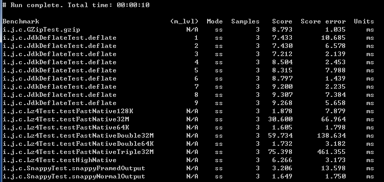

压缩算法性能对比
======

## Usage

change files
````
public class InputGenerator {
    private static final String JAVADOC_PATH = "C:/test";
    public static final  File   FILE_PATH    = new File("D:/test/a.file");
````


`mvn clean package`
`java -jar target/benchmarks.jar`

## Performance




## doc
<http://java-performance.info/performance-general-compression>
